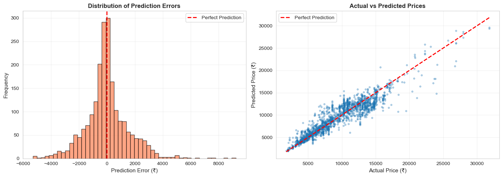
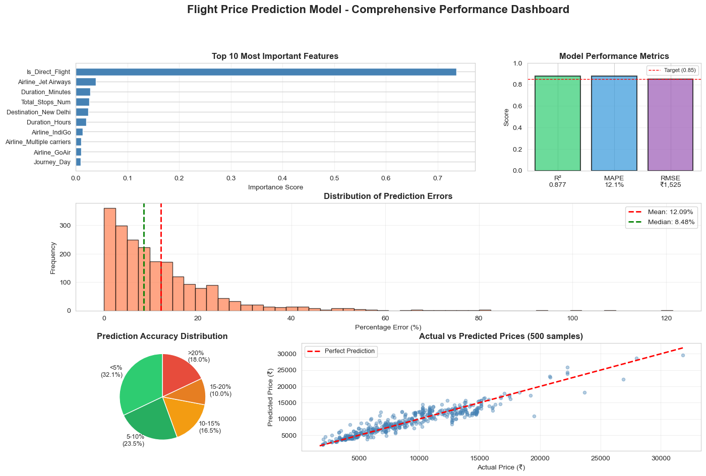

## Project Overview

This project focuses on predicting flight ticket prices using machine learning. The aim is to help travelers, booking platforms and travel management systems estimate ticket prices based on several travel-related features such as airline, number of stops, route, departure and arrival times, class type, travel duration and more. Multiple regression models were trained and evaluated to determine the most reliable model for production deployment.

## Objectives

1. Perform exploratory data analysis to understand pricing patterns
2. Build and train multiple machine learning regression models
3. Compare performance metrics and identify the best performing model
4. Create a reusable prediction pipeline for real world inference

## Dataset

The dataset contains flight booking records with the following core attributes
Airline
Source
Destination
Number of Stops
Date of Journey
Departure Time
Arrival Time
Duration
Route
Class
Price (target variable)

## Tools and Technologies

Python
Pandas
NumPy
Matplotlib
Seaborn
Scikit-learn
XGBoost
CatBoost
LightGBM
Jupyter Notebook

## Methodology

Data cleaning and preprocessing
Feature engineering including date and time conversion duration extraction and categorical encoding
Training and evaluation of six regression models
Cross validation for stable performance estimation
Final model selection based on accuracy and generalization capability

## Model Training Results

Six models were trained and evaluated on R² RMSE MAE and MAPE metrics.

The best performing model
XGBoost
R² Score 0.5207
RMSE ₹3013
MAPE 24.86

Random Forest and LightGBM also showed competitive performance but XGBoost demonstrated the most balanced results between accuracy and generalization.

## Model Evaluation Visualizations

### Prediction Error Analysis



### Comprehensive Performance Dashboard



## Key Insights

Flight price is strongly influenced by airline class type and number of stops
Premium airlines and business class significantly increase fares
Prices rise during late night and early morning departures
Direct flights generally cost more than flights with stops but the difference depends on the carrier

## How to Run

1. Install required dependencies

```
pip install -r requirements.txt
```

2. Run the notebook

```
jupyter notebook Flight_Price_Prediction.ipynb
```

3. For prediction using saved model

```
python predict.py
```

## Repository Structure

```
project_root
  ├── data
  ├── images
  ├── models
  ├── notebooks
  ├── src
  ├── requirements.txt
  ├── predict.py
  └── README.md
```

## Future Scope

Integration into a web based or mobile booking system
Model retraining with real time data
Introduction of seasonal factors and market demand indexing
Deployment using Flask FastAPI or cloud services

## Author

Muhammed Sayees
